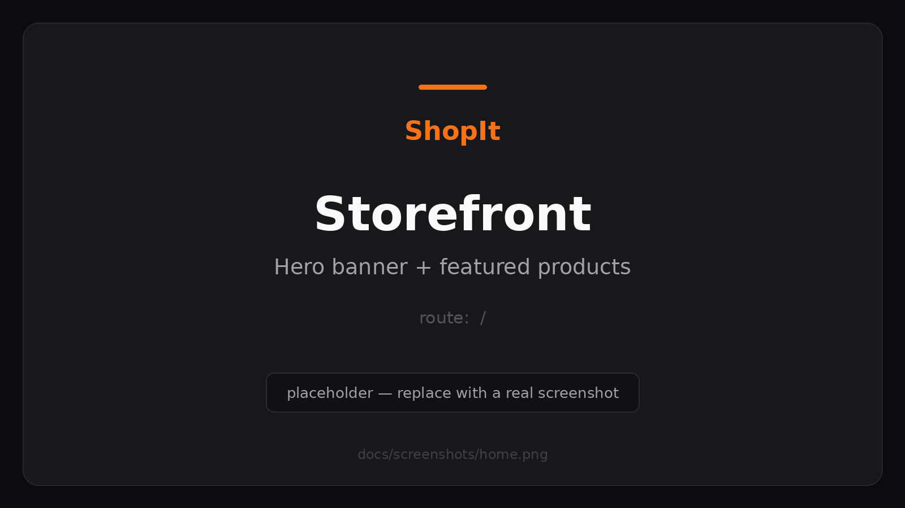
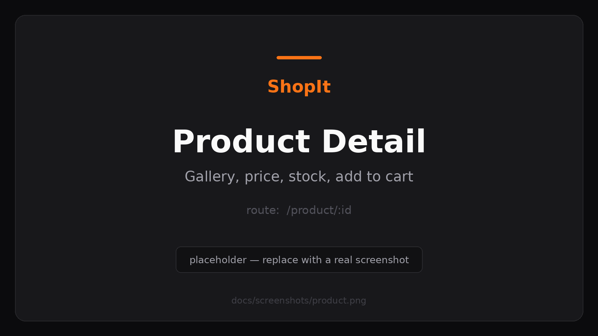
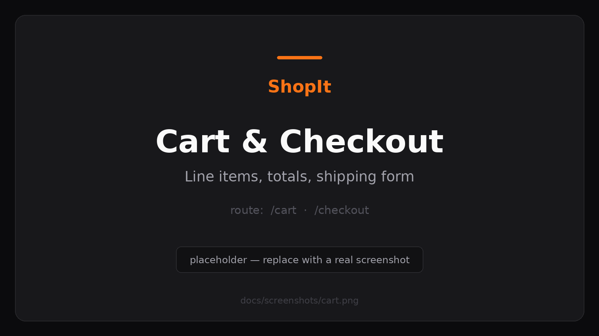
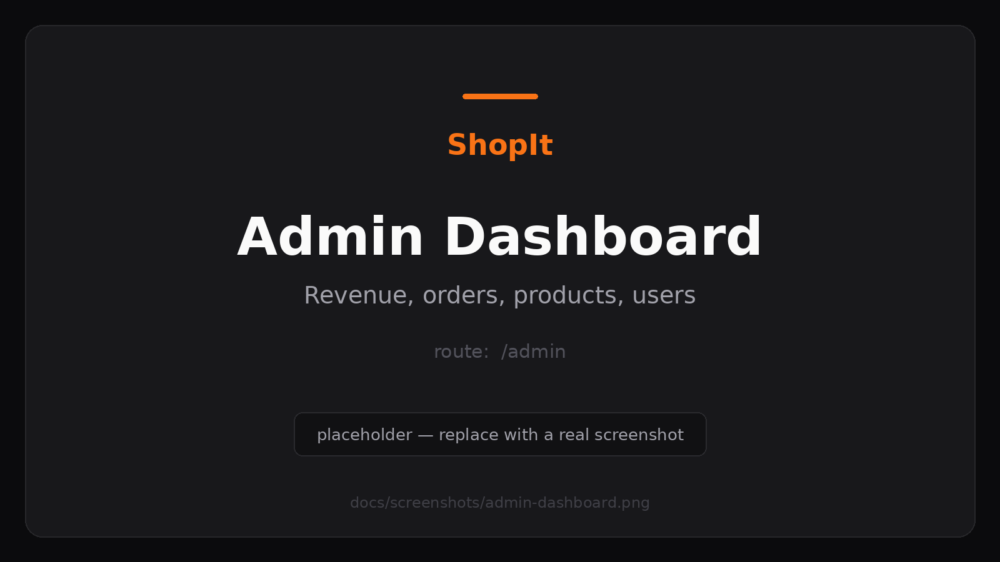
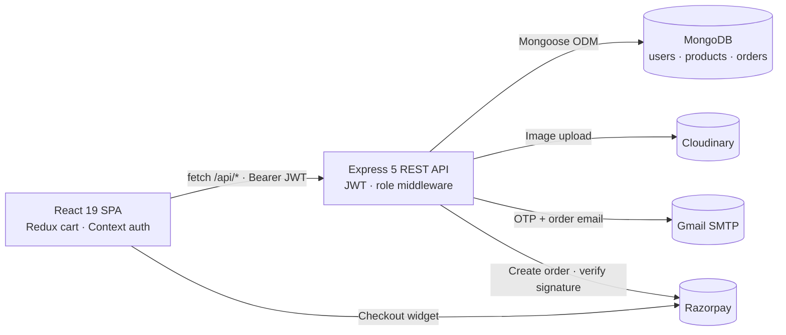
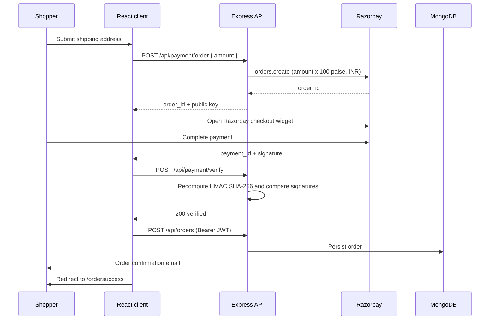

<div align="center">


# ShopIt

**A production-style MERN e-commerce platform with OTP-verified accounts, Razorpay checkout and a role-based admin console.**

[](https://shopit-frontend-98c1.onrender.com/)


[Live Demo](#live-demo) · [Features](#features) · [Architecture](#architecture) · [Getting Started](#getting-started) · [API Reference](#api-reference) · [Roadmap](#roadmap)

</div>

---

## Overview

ShopIt is a full-stack storefront built on the MERN stack. It covers the complete commercial path — a shopper discovers a product, adds it to a persistent cart, pays through Razorpay, and receives an email confirmation — alongside an admin console where catalogue, orders and revenue are managed behind role-based authorization.

The project was built to practise the parts of e-commerce that are usually skipped in tutorials: email OTP account verification before first login, HMAC signature verification on payment callbacks, server-side image uploads to a CDN, and an analytics endpoint that only an admin role can reach. The React client is a single-page app with a dark, orange-accented UI; the Express API is a stateless JSON service that can be deployed independently of the frontend.

---

## Live Demo

**➡️ [shopit-frontend-98c1.onrender.com](https://shopit-frontend-98c1.onrender.com/)**

> Hosted on Render's free tier, so the first request after a period of inactivity can take 30–60 seconds while the service wakes up. Give it a moment before assuming it's down.

### Demo accounts

These are the accounts created by the seed script (`npm run seed`), so you can explore both sides of the app without registering:

| Role      | Email                | Password    | What you can see                                           |
| --------- | -------------------- | ----------- | ---------------------------------------------------------- |
| **Admin** | `admin@shopit.com`   | `Admin123!` | Dashboard stats, product CRUD, all orders, all users        |
| Customer  | `rahul@example.com`  | `User123!`  | Storefront, cart, checkout, personal order history          |

Both seeded accounts are pre-verified, so they skip the OTP step. The demo catalogue is disposable — `npm run seed` restores products, users and sample orders at any time.

---

## Screenshots

| Storefront | Product detail |
| :--------: | :------------: |
|  |  |
| **Cart & checkout** | **Admin dashboard** |
|  |  |

<!--
The four files in docs/screenshots/ are themed placeholders. Replace them with real
captures using the SAME filenames and this table needs no edits:
  docs/screenshots/home.png             -> "/" with the hero banner and featured products
  docs/screenshots/product.png          -> "/product/:id" for a seeded product
  docs/screenshots/cart.png             -> "/cart" or "/checkout" with 2-3 items in the cart
  docs/screenshots/admin-dashboard.png  -> "/admin" logged in as admin@shopit.com
Capture at 1600x900 in a maximised browser window for consistent framing.
-->

---

## Features

### Storefront

- **Email-verified registration.** Signing up hashes the password with bcrypt and emails a six-digit OTP that expires after 10 minutes. Login is rejected with `403` until the address is verified.
- **JWT sessions.** Successful login returns a seven-day token; the client keeps the session in React Context and mirrors it to `localStorage` so a refresh doesn't log you out.
- **Product discovery.** A featured-products strip on the home page, a full catalogue page, and instant client-side search by product name.
- **Product detail pages** with category breadcrumb, price, stock and description.
- **Persistent cart** backed by a Redux Toolkit slice that writes through to `localStorage` — add items, change quantities, remove lines, or clear the cart, and it survives a browser restart.
- **Razorpay checkout** with a shipping-address form, INR totals, and signature verification before the order is written.
- **Transactional email.** Order confirmations are sent through Nodemailer, and a failed email never rolls back a successfully saved order.
- **Order history** on the profile page, with each line item populated from the product catalogue.
- Supporting pages for About, Disclaimer and Return Policy.

### Admin console

- **Role-gated access.** Every admin route passes through `protect` (valid JWT) and then `admin` (role check), which answers `403` for non-admin tokens.
- **Dashboard metrics** — total customers, total orders, total products and gross revenue aggregated from all orders.
- **Product management** — create, edit and delete products, with image uploads streamed through Multer to Cloudinary and stored as CDN URLs.
- **Order management** — view every order with the customer name attached, and move each one through `Processing → Shipped → Delivered`.
- **User management** — list registered accounts, scoped so that only the primary admin account sees the full user table.

### Platform

- Stateless JSON API that can be hosted separately from the client, with a CORS allowlist driven by environment variables.
- Cloudinary for media, so no user-uploaded binaries are served off the application server.
- A seed script that is **idempotent** — it upserts users and products by unique key instead of wiping the database, so re-running it is safe.
- Defensive MongoDB connection with an explicit 10-second timeout and custom DNS resolvers, which avoids the silent hangs that Atlas SRV lookups cause on some networks.

---

## Tech Stack

| Layer          | Technology                                                                 |
| -------------- | -------------------------------------------------------------------------- |
| Frontend       | React 19, React Router 7, Redux Toolkit 2, React Context, plain CSS modules |
| Backend        | Node.js, Express 5                                                          |
| Database       | MongoDB with Mongoose 9                                                     |
| Authentication | JSON Web Tokens, bcryptjs, email OTP verification                           |
| Payments       | Razorpay Orders API with HMAC SHA-256 signature verification                |
| Media          | Multer (multipart parsing) → Cloudinary (storage and delivery)              |
| Email          | Nodemailer over Gmail SMTP                                                  |
| Tooling        | nodemon, concurrently, dotenv, Create React App                             |

---

## Architecture



The client never talks to the database and never holds a payment secret. Requests to `/api/*` are rewritten to the deployed API host by a small `fetch` wrapper (`frontend/src/setupApi.js`), which means the same component code works against `localhost:5000` in development and a Render service in production without any conditional logic.

### Checkout flow



> **Demo fallback:** if `RAZORPAY_KEY_ID` / `RAZORPAY_KEY_SECRET` are absent, `POST /api/payment/order` returns an error and the checkout page offers to place a test order with a synthetic payment reference. This keeps the flow demonstrable without live keys — see [Roadmap](#roadmap) for the server-side reconciliation that production use would require.

### Two backend entry points

| File                | Used by                       | Behaviour                                                                                 |
| ------------------- | ----------------------------- | ----------------------------------------------------------------------------------------- |
| `backend/index.js`  | `npm start`, `npm run dev`    | API only. CORS allowlist supports a comma-separated `FRONTEND_URL`. Use this for a split deploy (API and static client hosted separately). |
| `backend/server.js` | run directly with `node`      | Same routes, but when `NODE_ENV=production` it also serves `frontend/build` and falls back to `index.html` for SPA routes — a single-service deploy. |

---

## Project Structure

```
ShopIt/
├── backend/
│   ├── config/
│   │   ├── cloudinary.js        # Cloudinary SDK configuration
│   │   └── db.js                # Mongoose connection with timeout guard
│   ├── controller/
│   │   ├── analyticsController.js   # Admin dashboard aggregates
│   │   ├── authController.js        # Register, OTP verify, login, user list
│   │   ├── orderController.js       # Create order, history, admin list, status
│   │   ├── paymentController.js     # Razorpay order + signature verification
│   │   └── productController.js     # Product CRUD + Cloudinary uploads
│   ├── middleware/
│   │   ├── adminMiddleware.js   # Role check (403 for non-admins)
│   │   └── authMiddleware.js    # Bearer JWT verification
│   ├── model/
│   │   ├── order.js
│   │   ├── product.js
│   │   └── user.js
│   ├── routes/                  # auth, products, orders, payment, analytics
│   ├── utils/sendEmail.js       # Nodemailer transport
│   ├── seed.js                  # Idempotent demo data seeder
│   ├── index.js                 # API-only entry point
│   └── server.js                # Single-service entry point
│
├── frontend/
│   ├── public/
│   └── src/
│       ├── admin/               # Dashboard, product CRUD, orders, users
│       ├── components/          # Navbar, Footer, ProductCard
│       ├── context/             # AuthContext
│       ├── pages/               # Home, Shop, ProductDetail, Cart, Checkout, auth, policies
│       ├── redux/               # cartSlice, store
│       ├── styles/              # global, navbar, auth, cart, product CSS
│       ├── setupApi.js          # Rewrites /api/* to the deployed API host
│       └── App.jsx              # Route table
│
├── docs/screenshots/
├── package.json                 # Workspace scripts (install-all, dev, build, seed)
└── README.md
```

---

## Getting Started

### Prerequisites

- Node.js 20.19 or newer and npm (required by Mongoose 9)
- A MongoDB database — local (`mongodb://127.0.0.1:27017/shopit`) or a free MongoDB Atlas cluster
- Optional for full functionality: a Cloudinary account (product images), a Razorpay test account (payments), and a Gmail account with an [App Password](https://support.google.com/accounts/answer/185833) (OTP and order emails)

### 1. Clone and install

```bash
git clone https://github.com/Sayan200427/ShopIt.git
cd ShopIt
npm run install-all
```

`install-all` installs the root, backend and frontend dependency trees in one pass.

### 2. Configure environment variables

Create `backend/.env`:

```env
PORT=5000
MONGO_URI=mongodb://127.0.0.1:27017/shopit
JWT_SECRET=replace_with_a_long_random_string

CLOUDINARY_CLOUD_NAME=your_cloud_name
CLOUDINARY_API_KEY=your_api_key
CLOUDINARY_API_SECRET=your_api_secret

RAZORPAY_KEY_ID=your_razorpay_key_id
RAZORPAY_KEY_SECRET=your_razorpay_key_secret

EMAIL_USER=your_email@gmail.com
EMAIL_PASS=your_gmail_app_password

FRONTEND_URL=http://localhost:3000
NODE_ENV=development
```

Create `frontend/.env`:

```env
REACT_APP_BACKEND_URL=http://localhost:5000
```

### 3. Seed demo data

```bash
npm run seed
```

Creates the demo admin, two customers, six products across five categories, and two sample orders. Safe to re-run — records are upserted, not duplicated.

### 4. Run in development

```bash
npm run dev
```

`concurrently` starts the API on `http://localhost:5000` (nodemon) and the React dev server on `http://localhost:3000`.

---

## Environment Variables

### Backend (`backend/.env`)

| Variable                 | Required | Description                                                                       |
| ------------------------ | :------: | --------------------------------------------------------------------------------- |
| `PORT`                   |    No    | API port. Defaults to `5000`.                                                      |
| `MONGO_URI`              |   Yes    | MongoDB connection string. The process exits if the connection fails.               |
| `JWT_SECRET`             |   Yes    | Signing secret for seven-day access tokens.                                        |
| `CLOUDINARY_CLOUD_NAME`  |    No*   | Cloudinary account name.                                                            |
| `CLOUDINARY_API_KEY`     |    No*   | Cloudinary API key.                                                                 |
| `CLOUDINARY_API_SECRET`  |    No*   | Cloudinary API secret. *Required to upload product images.                          |
| `RAZORPAY_KEY_ID`        |    No*   | Razorpay public key, returned to the client to open the widget.                     |
| `RAZORPAY_KEY_SECRET`    |    No*   | Razorpay secret, used for HMAC verification. *Required for real payments.           |
| `EMAIL_USER`             |    No*   | Gmail address used as the sender.                                                   |
| `EMAIL_PASS`             |    No*   | Gmail App Password. *Required for OTP and order emails.                             |
| `FRONTEND_URL`           |    No    | Comma-separated list of allowed CORS origins, added to the localhost defaults.       |
| `NODE_ENV`               |    No    | `production` hides error details in API responses and enables static serving in `server.js`. |

### Frontend (`frontend/.env`)

| Variable                | Required | Description                                                                                        |
| ----------------------- | :------: | -------------------------------------------------------------------------------------------------- |
| `REACT_APP_BACKEND_URL` |    No    | Base URL of the API. Leave unset in development to use the CRA proxy; set it for a split deploy.    |

> `.env` files are gitignored. Commit only the `.env.example` templates.

---

## Available Scripts

Run from the repository root:

| Script                  | Description                                                        |
| ----------------------- | ------------------------------------------------------------------ |
| `npm run install-all`   | Install root, backend and frontend dependencies                    |
| `npm run dev`           | Run the API and React dev server together                          |
| `npm run start:backend` | Backend only, with nodemon reload                                  |
| `npm run start:frontend`| React dev server only                                              |
| `npm run build`         | Production build of the React client into `frontend/build`          |
| `npm start`             | Start the API with `node` (production)                             |
| `npm run seed`          | Populate the database with demo users, products and orders          |

---

## API Reference

Base URL: `http://localhost:5000/api`

Protected endpoints expect an `Authorization: Bearer <token>` header. **User** means any authenticated account; **Admin** additionally requires `role: "admin"`.

### Authentication — `/api/auth`

| Method | Endpoint      | Access | Description                                                                 |
| ------ | ------------- | ------ | --------------------------------------------------------------------------- |
| `POST` | `/register`   | Public | Create an account, hash the password, email a six-digit OTP (10-minute TTL) |
| `POST` | `/verify-otp` | Public | Verify the OTP and mark the account as verified                             |
| `POST` | `/login`      | Public | Return a seven-day JWT — `403` if the email is not yet verified             |
| `GET`  | `/users`      | Admin  | List accounts without password hashes                                       |

### Products — `/api/products`

| Method   | Endpoint | Access | Description                                                    |
| -------- | -------- | ------ | -------------------------------------------------------------- |
| `GET`    | `/`      | Public | List all products                                              |
| `GET`    | `/:id`   | Public | Fetch a single product                                         |
| `POST`   | `/`      | Admin  | Create a product — `multipart/form-data` with an `image` field |
| `PUT`    | `/:id`   | Admin  | Update a product, optionally replacing the image               |
| `DELETE` | `/:id`   | Admin  | Delete a product                                               |

### Orders — `/api/orders`

| Method | Endpoint      | Access | Description                                                          |
| ------ | ------------- | ------ | -------------------------------------------------------------------- |
| `POST` | `/`           | User   | Place an order and send a confirmation email                         |
| `GET`  | `/myorders`   | User   | Order history for the authenticated user, with product names resolved |
| `GET`  | `/`           | Admin  | Every order, with the customer name populated                        |
| `PUT`  | `/:id/status` | Admin  | Set status to `Processing`, `Shipped` or `Delivered`                  |

### Payments — `/api/payment`

| Method | Endpoint  | Access | Description                                                            |
| ------ | --------- | ------ | ---------------------------------------------------------------------- |
| `POST` | `/order`  | Public | Create a Razorpay order — the INR amount is converted to paise         |
| `POST` | `/verify` | Public | Recompute the HMAC SHA-256 signature and confirm the payment is genuine |

### Analytics — `/api/analytics`

| Method | Endpoint | Access | Description                                                        |
| ------ | -------- | ------ | ------------------------------------------------------------------ |
| `GET`  | `/`      | Admin  | `totalUsers`, `totalOrders`, `totalProducts` and `totalRevenue`     |

### Example — register and verify

```bash
curl -X POST http://localhost:5000/api/auth/register \
  -H "Content-Type: application/json" \
  -d '{"name":"Sayan","email":"sayan@example.com","password":"Secret123!"}'

curl -X POST http://localhost:5000/api/auth/verify-otp \
  -H "Content-Type: application/json" \
  -d '{"email":"sayan@example.com","otp":"123456"}'
```

---

## Data Models

**User** — `name`, `email` (unique), `password` (bcrypt hash), `role` (`user` | `admin`), `verified`, `otp`, `otpExpires`, timestamps.

**Product** — `name`, `description`, `price`, `category`, `stock`, `imageUrl` (array of Cloudinary URLs), `ratings`, `numReviews`, `createdAt`.

**Order** — `user` (ref `User`), `products` (array of `{ productId, quantity, price }`), `totalAmount`, `address` (`fullName`, `street`, `city`, `postalCode`, `state`, `country`), `paymentId`, `status` (`Processing` | `Shipped` | `Delivered`), timestamps.

Line-item prices are copied onto the order at purchase time, so later catalogue price changes never rewrite historical orders.

---

## Deployment

The app is deployed on Render as two services. Any Node host works the same way.

**Backend — Web Service**

| Setting        | Value                                                    |
| -------------- | -------------------------------------------------------- |
| Root directory | `backend`                                                |
| Build command  | `npm install`                                            |
| Start command  | `npm start`                                              |
| Environment    | All backend variables above, with `NODE_ENV=production` and `FRONTEND_URL` set to the deployed client origin so CORS accepts it |

**Frontend — Static Site**

| Setting          | Value                                              |
| ---------------- | -------------------------------------------------- |
| Root directory   | `frontend`                                         |
| Build command    | `npm install && npm run build`                     |
| Publish directory| `build`                                            |
| Environment      | `REACT_APP_BACKEND_URL` = deployed API URL         |

Two things that are easy to miss: `REACT_APP_*` variables are inlined at **build** time, so changing the API URL requires a rebuild rather than a restart; and a client-side router needs a rewrite rule sending `/*` to `/index.html`, otherwise deep links such as `/admin/orders` return 404 on refresh.

To deploy as a single service instead, build the client, set `NODE_ENV=production`, and start `backend/server.js` — it serves the API and the static bundle from one origin, which removes the CORS configuration entirely.

---

## Roadmap

Known gaps, roughly in the order they are worth fixing:

- **Server-side payment reconciliation.** The order is written after the client reports a successful verification, and the payment routes are unauthenticated. A Razorpay webhook that creates the order server-side would close the gap between "paid" and "recorded".
- **Stock decrement on purchase.** `stock` is stored and displayed but not reduced when an order is placed, so overselling is possible.
- **Reviews.** `ratings` and `numReviews` exist on the product model with no endpoints behind them yet.
- **Server-side catalogue queries.** Search currently filters an already-downloaded product list in the browser; category filters, sorting and pagination belong in `GET /api/products`.
- **Token handling.** JWTs live in `localStorage`; httpOnly refresh cookies with rotation would be a meaningful hardening step.
- **Automated tests.** React Testing Library and Jest are installed but no suites are written; API integration tests via Supertest are the higher-value target.
- **Product features.** Wishlist, coupon codes, shipment tracking and multi-image galleries.

---

## Contributing

Issues and pull requests are welcome.

```bash
git checkout -b feature/your-feature
git commit -m "Add your feature"
git push origin feature/your-feature
```

Then open a pull request describing the change and how you tested it.

---

## License

Released under the [MIT License](LICENSE).

---

## Author

**Sayan Biswas**

[](https://github.com/Sayan200427)
[](https://www.linkedin.com/in/your-linkedin-handle)

<!-- Replace "your-linkedin-handle" above with your actual LinkedIn vanity URL. -->

If ShopIt was useful or interesting to you, a ⭐ on the repository is appreciated.
